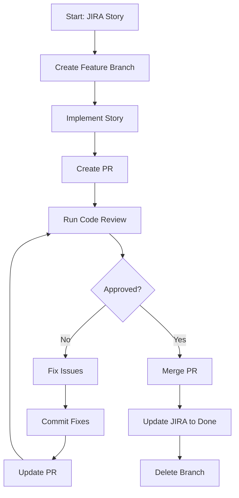

# Dev Review Loop Command

Automated development and code review loop that continues until code passes review and is merged.

## Usage
```
/dev-review-loop [STORY-ID]
```

Examples:
- `/dev-review-loop PROJ-123` - Implement story with review loop
- `/dev-review-loop --pr 456` - Continue review loop for existing PR

## What This Command Does

Complete automated loop:
1. **Implements story** on feature branch
2. **Creates PR** with full details
3. **Runs code review** with comprehensive checks
4. **Fixes issues** automatically
5. **Re-requests review** after fixes
6. **Continues until approved**
7. **Merges PR** when approved
8. **Updates JIRA** throughout process

## The Loop Process



## Implementation Phase

```javascript
async function startDevReviewLoop(storyId) {
  // Phase 1: Implementation
  await Task({
    subagent_type: "general-purpose",
    description: "Implement story",
    prompt: `Use story-implementer agent to:

    1. Fetch story ${storyId} from JIRA
    2. Create feature branch
    3. Work through all subtasks
    4. Update JIRA in real-time
    5. Commit after each subtask
    6. Create comprehensive PR

    Return the PR number when complete.`
  });

  // Phase 2: Review Loop
  let approved = false;
  let iteration = 1;

  while (!approved && iteration <= 10) {
    const review = await runCodeReview(prNumber);

    if (review.decision === 'APPROVED') {
      approved = true;
    } else {
      await fixReviewIssues(prNumber, review.issues);
      iteration++;
    }
  }

  // Phase 3: Merge
  if (approved) {
    await mergePR(prNumber);
    await updateJiraComplete(storyId);
  }
}
```

## Review Phase

```javascript
async function runCodeReview(prNumber) {
  return await Task({
    subagent_type: "general-purpose",
    description: "Code review",
    prompt: `Use code-reviewer agent to:

    Review PR #${prNumber} checking:
    1. SOLID principles (functions < 20 lines)
    2. Test coverage (>90%)
    3. Security vulnerabilities
    4. Performance issues
    5. BDD/TDD compliance
    6. No placeholder code
    7. No console.log statements
    8. Proper error handling

    Return structured findings with:
    - decision: APPROVED/CHANGES_REQUESTED
    - issues: array of specific issues
    - suggestions: how to fix each issue`
  });
}
```

## Fix Phase

```javascript
async function fixReviewIssues(prNumber, issues) {
  console.log(`🔧 Fixing ${issues.length} review issues...`);

  // Checkout PR branch
  await bash(`gh pr checkout ${prNumber}`);

  for (const issue of issues) {
    await Task({
      subagent_type: "general-purpose",
      description: `Fix: ${issue.type}`,
      prompt: `Fix the following issue:

      File: ${issue.file}
      Line: ${issue.line}
      Issue: ${issue.description}
      Suggestion: ${issue.suggestion}

      Make the minimal change needed to fix this.
      Do not break existing functionality.`
    });

    // Commit each fix
    await bash(`git add -A && git commit -m "fix: ${issue.type} - ${issue.description}"`);
  }

  // Push all fixes
  await bash(`git push origin HEAD`);

  // Add comment to PR
  await bash(`gh pr comment ${prNumber} --body "🔧 Fixed ${issues.length} review issues:\n${
    issues.map(i => `- ${i.description}`).join('\n')
  }\n\n🔄 Ready for re-review"`);
}
```

## Merge Phase

```bash
function mergePR() {
  local PR_NUMBER=$1

  echo "✅ PR approved! Merging..."

  # Merge PR
  gh pr merge $PR_NUMBER \
    --merge \
    --delete-branch \
    --subject "Merge PR #$PR_NUMBER: $STORY_ID" \
    --body "Automated merge after passing review"

  # Update JIRA
  STORY_ID=$(gh pr view $PR_NUMBER --json body | jq -r '.body' | grep -oP 'Story: \K[A-Z]+-\d+')

  acli jira issue transition "$STORY_ID" --transition "Done"
  acli jira issue comment add "$STORY_ID" \
    --comment "✅ PR #$PR_NUMBER merged after passing code review"
}
```

## Review Criteria

The loop enforces these standards:

### Must Fix (Blocks Merge)
- Security vulnerabilities
- Missing tests (<90% coverage)
- Functions >20 lines
- Hardcoded credentials
- No error handling
- Console.log in production
- Type 'any' usage

### Should Fix (Warning)
- Complex functions
- Missing documentation
- Performance issues
- Code duplication
- Magic numbers

## Loop Status Updates

Throughout the loop, JIRA is updated:

```
Iteration 1:
- PR #456 created
- Review found 5 issues
- Fixing issues...

Iteration 2:
- Fixed 5 issues
- Review found 2 new issues
- Fixing issues...

Iteration 3:
- Fixed 2 issues
- Review APPROVED ✅
- Merging PR...
```

## Example Full Flow

```bash
/dev-review-loop PROJ-123

📋 Fetching PROJ-123: User Authentication
🌿 Created branch: feature/PROJ-123-user-authentication

Working on subtasks:
✅ 1/7: Write Gherkin scenario - Done
✅ 2/7: Create step definitions - Done
✅ 3/7: Implement functionality - Done
✅ 4/7: Write unit tests - Done
✅ 5/7: Code review - Done
✅ 6/7: Documentation - Done
✅ 7/7: Demo - Done

🔄 Created PR #456

🔍 Running code review...
❌ Review requested changes:
- Function authenticateUser() has 35 lines
- Missing test for edge case
- Hardcoded timeout value

🔧 Fixing 3 issues...
✅ Fixed: Split authenticateUser() into 3 functions
✅ Fixed: Added test for null password
✅ Fixed: Moved timeout to config

🔍 Running code review (iteration 2)...
✅ Code review APPROVED!

🎉 Merging PR #456...
✅ Merged and branch deleted
✅ JIRA PROJ-123 marked as Done

Complete! Story implemented and merged.
```

## Configuration

Set review strictness in config:

```json
{
  "review": {
    "maxIterations": 10,
    "autoFix": true,
    "requireApproval": true,
    "coverageThreshold": 90,
    "maxFunctionLines": 20,
    "blockOnSecurity": true
  }
}
```

## Benefits

1. **Fully Automated** - No manual intervention needed
2. **Quality Enforced** - Can't merge bad code
3. **Learning Loop** - Fixes get better each iteration
4. **JIRA Tracking** - Complete audit trail
5. **Time Saving** - No back-and-forth with reviewers