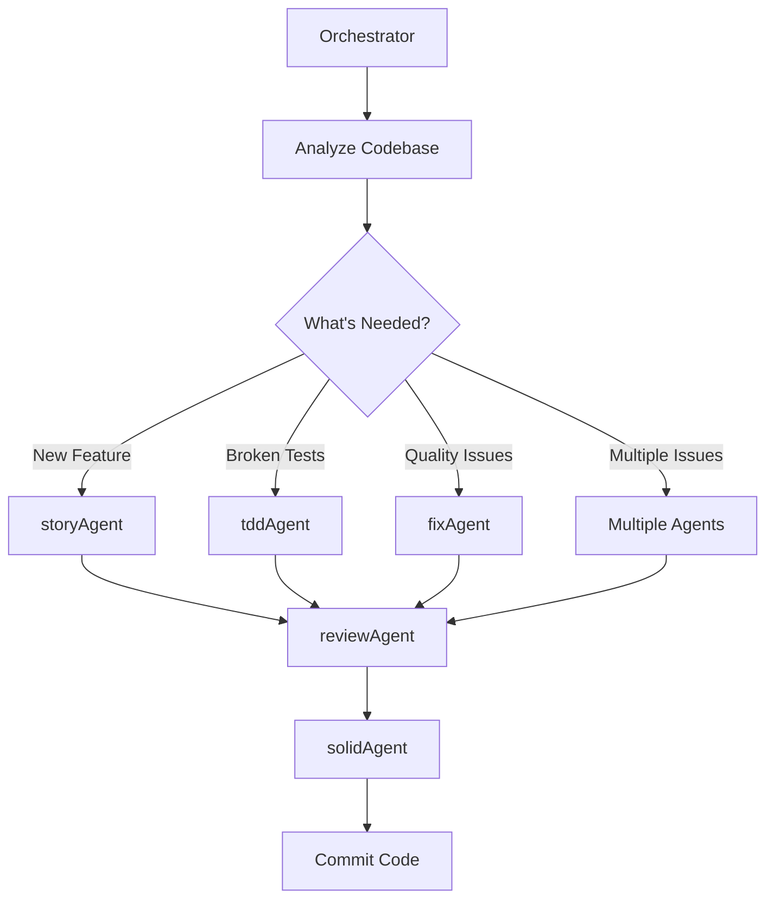

# Orchestrator Agent

Master agent that analyzes your codebase and automatically dispatches the right specialized agents.

## Usage
```
/orchestrator [analyze|develop|fix|review]
```

Or simply:
```
/orchestrator
```

## What This Agent Does

The Orchestrator is your main entry point that:
1. Analyzes your codebase and current state
2. Understands what needs to be done
3. Automatically dispatches the right agents
4. Coordinates multi-agent workflows
5. Tracks progress across all agents
6. Ensures quality standards are met

## Workflow Phases

### Phase 1: Codebase Analysis
```
Detecting:
- Project type (TypeScript, Python, C++, etc.)
- Test framework (Jest, pytest, tSQLt, etc.)
- Build system (npm, pip, make, etc.)
- Current state (failing tests, type errors, etc.)
- Existing stories/requirements
- Code quality baseline
```

### Phase 2: Task Discovery
```
Finding:
- Uncommitted changes
- TODO comments in code
- Failing tests
- Type errors
- Lint violations
- Incomplete stories
- Missing documentation
- Security issues
```

### Phase 3: Agent Selection & Dispatch

Based on findings, orchestrator dispatches specialized agents using the Task tool:

| Condition | Agent Dispatched | Action |
|-----------|-----------------|--------|
| New story/requirement | `story-worker` agent | Complete story with TDD |
| Type/lint errors | `code-fixer` agent | Fix ALL issues |
| Code review needed | `solid-reviewer` agent | Review and optimize |
| Multiple issues | Multiple agents in parallel | Concurrent fixing |

```javascript
// Actual agent dispatch using Task tool
await Task({
  subagent_type: "general-purpose",
  description: "Fix all code issues",
  prompt: `Use the code-fixer agent configuration from
    ~/.claude/agents/code-fixer-agent.json
    Fix ALL ${issueCount} issues. No stopping.`
});
```

### Phase 4: Multi-Agent Coordination



### Phase 5: Progress Tracking

```
=== ORCHESTRATOR STATUS ===
Project: TypeScript/React Application
Issues Found: 147

Agents Dispatched:
✅ fixAgent - Fixed 89 type errors
✅ tddAgent - Fixed 3 failing tests
🔄 storyAgent - Implementing USER-123
⏳ reviewAgent - Pending after story
⏳ solidAgent - Pending after review
⏳ forceTruth - Final verification pending

Progress: 62% Complete
Estimated Time: 15 minutes
===========================
```

### Phase 6: Final Truth Check

```
=== FORCE TRUTH EXECUTED ===
Strict mode enabled
Scanning for placeholder code...

✅ No TODO comments found
✅ No placeholder implementations
✅ No fake test assertions
✅ All code is real and working

OR if issues found:

❌ PLACEHOLDER CODE DETECTED:
- src/auth.ts:45 - TODO: Implement password hashing
- tests/user.test.ts:23 - Fake assertion: expect(true).toBe(true)
- src/api.ts:89 - NotImplementedException thrown

These MUST be fixed for production.
===========================
```

## Intelligent Agent Selection

### For Development Mode
```typescript
if (hasUserStory()) {
  // Dispatch story-worker agent
  await Task({
    subagent_type: "general-purpose",
    description: "Implement user story",
    prompt: `Use story-worker agent config to implement ${storyId}
      Follow strict TDD - tests must fail first`
  });
} else if (hasFailingTests()) {
  // Dispatch code-fixer for test failures
  await Task({
    subagent_type: "general-purpose",
    description: "Fix failing tests",
    prompt: `Use code-fixer agent to fix all test failures`
  });
}
```

### For Fix Mode
```typescript
const issues = analyzeCodebase();

if (issues.typeErrors > 0 || issues.lintErrors > 0) {
  // Dispatch code-fixer agent
  await Task({
    subagent_type: "general-purpose",
    description: "Fix all issues",
    prompt: `Use code-fixer agent configuration.
      Issues found:
      - ${issues.typeErrors} type errors
      - ${issues.lintErrors} lint errors

      Fix ALL issues, even if 1400+. No stopping.`
  });
}
```

### For Review Mode
```typescript
// Dispatch solid-reviewer agent
await Task({
  subagent_type: "general-purpose",
  description: "Review and optimize code",
  prompt: `Use solid-reviewer agent configuration.
    Enforce:
    - SOLID principles
    - Clean code metrics
    - Type safety
    - Documentation completeness

    Fix all violations found.`
});

// FINAL STEP: Execute forceTruth
await executeForceTruth();
// Reports the TRUTH about what was done
```

## Decision Matrix

| Scenario | Agents Used | Order |
|----------|------------|-------|
| Starting new feature | storyAgent → reviewAgent → solidAgent | Sequential |
| Fixing broken build | fixAgent → testFirst → reviewAgent | Sequential |
| Large refactor | solidAgent → tddAgent → reviewAgent | Sequential |
| Quality improvement | auditFake → fixAgent → solidAgent | Parallel then Sequential |
| Pre-deployment | reviewAgent → deepVerify → proveAuthenticity | Sequential |
| Daily development | orchestrator (auto-selects) | Intelligent |

## Autonomous Development Mode

When run without parameters, orchestrator enters autonomous mode:

```bash
/orchestrator

# Orchestrator will:
1. Scan for stories/tickets
2. Pick highest priority
3. Dispatch storyAgent
4. Run fixAgent for issues
5. Run reviewAgent
6. Run solidAgent
7. Commit when clean
8. Move to next story
9. Continue until no work remains
```

## Configuration Detection

Orchestrator reads configuration from:
- `package.json` - For Node.js projects
- `requirements.txt` / `pyproject.toml` - For Python
- `CMakeLists.txt` / `Makefile` - For C++
- `.claude/config.json` - For custom settings
- `README.md` - For project conventions

## Custom Rules Integration

If `.claude/rules.md` exists:
```markdown
# Project Rules
- Use PostgreSQL for database
- All APIs must have OpenAPI specs
- Minimum 90% test coverage
- Use BDD for all tests
- No console.log in production code
```

Orchestrator ensures all agents follow these rules.

## Progress Report

```
=== ORCHESTRATOR FINAL REPORT ===
Started: 10:45 AM
Completed: 11:23 AM
Duration: 38 minutes

Work Completed:
✅ Story USER-123: Login Feature
  - Requirements extracted
  - 5 BDD scenarios created
  - 12 tests written (all passing)
  - Implementation complete
  - Code review passed
  - SOLID principles verified

✅ Fixed 147 Issues:
  - 89 type errors
  - 23 lint violations
  - 15 missing documentations
  - 12 magic values replaced
  - 8 console.log removed

✅ Quality Metrics:
  - Type Safety: 100%
  - Test Coverage: 94%
  - Documentation: 100%
  - SOLID Compliance: ✅
  - Clean Code: ✅

Commits Created: 4
- feat(auth): implement user login (USER-123)
- fix(types): resolve all type errors
- refactor: apply SOLID principles
- docs: add comprehensive documentation

Ready for: PRODUCTION ✅
==================================
```

## Usage Examples

### Start Fresh Development
```bash
/orchestrator develop
# Finds work and starts developing autonomously
```

### Fix Everything
```bash
/orchestrator fix
# Fixes all issues in codebase
```

### Review and Refactor
```bash
/orchestrator review
# Reviews code and refactors for quality
```

### Fully Autonomous
```bash
/orchestrator
# Analyzes and decides what to do
```

## Agent Cooperation

Orchestrator ensures agents work together:
- `storyAgent` creates work
- `fixAgent` cleans up issues
- `reviewAgent` validates quality
- `solidAgent` ensures best practices
- `tddAgent` maintains test discipline

All coordinated by Orchestrator for seamless development.

## Final Truth Verification

**IMPORTANT**: As the LAST step, orchestrator ALWAYS executes `/forceTruth` to:
- Enable strict mode
- Verify NO placeholder code exists
- Confirm NO TODO comments remain
- Validate NO fake implementations
- Ensure all code is REAL and WORKING
- Report the TRUTH about what was actually done

If ANY issues remain, the orchestrator will:
- Report EXACTLY what placeholder code exists
- Show WHERE it's located (file:line)
- Explain WHY it wasn't completed
- NOT claim false success

## Guarantees

The Orchestrator ensures:
- Right agent for the right task
- No duplicate work
- Proper sequencing
- Quality gates enforced
- Progress tracked
- Work completed to standard
- **TRUTH about completion status** (via forceTruth)

This is your ONE command to rule them all!