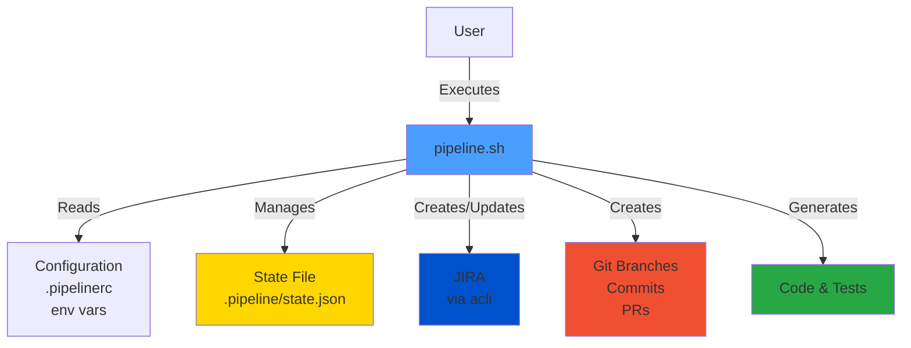
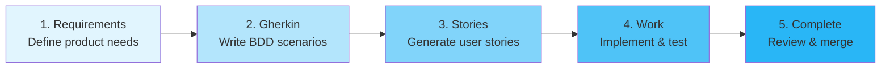
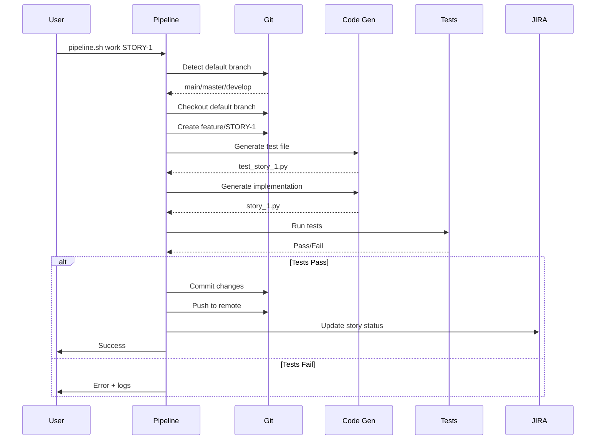
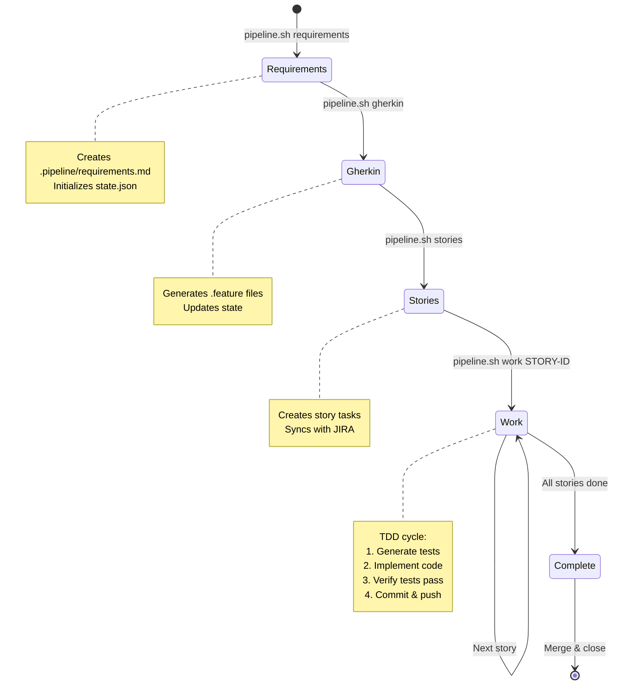
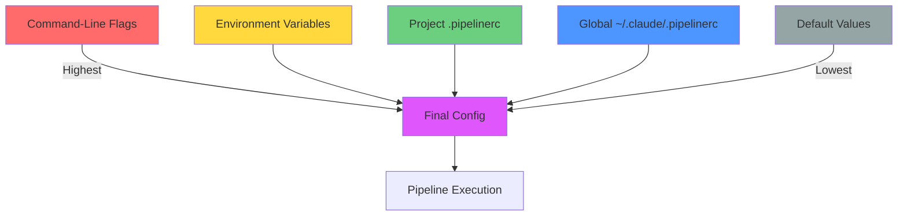
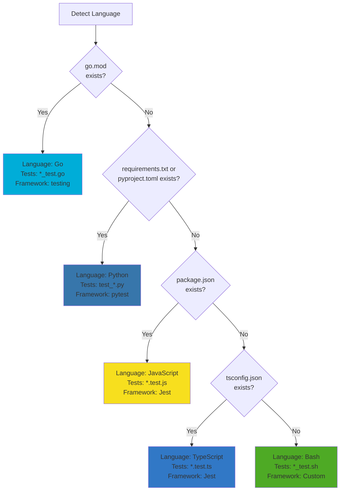
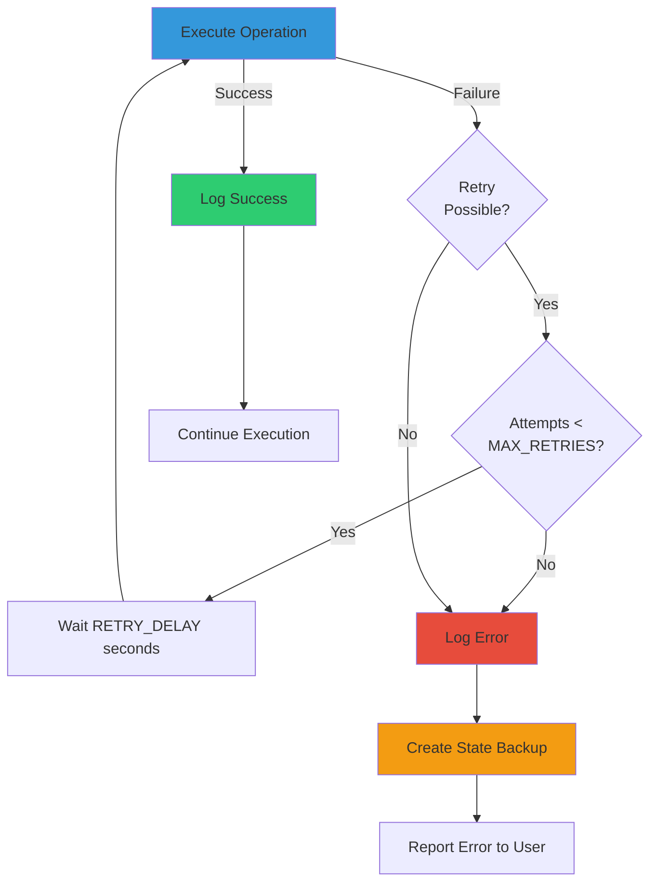
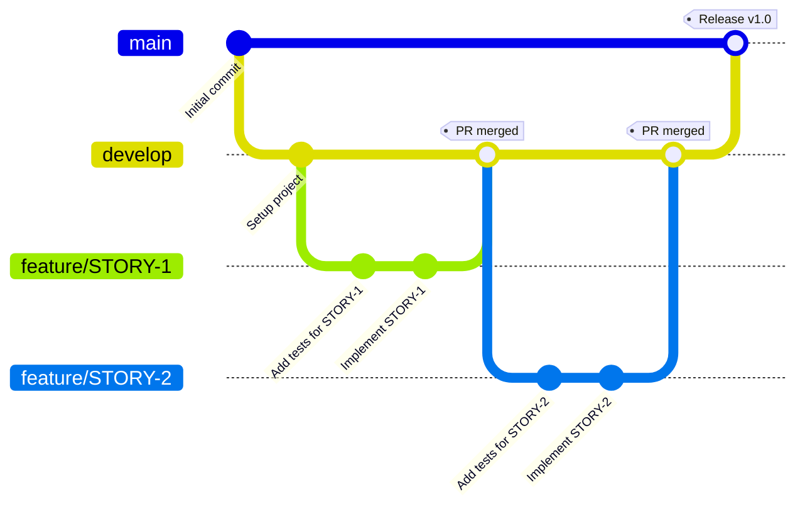
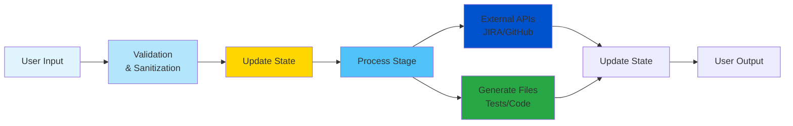

# Pipeline Architecture Diagram

## High-Level Architecture



## Pipeline Stages Flow



## Detailed Work Stage Flow



## State Management



## Configuration Priority



## Language Detection Flow



## Error Handling Flow



## Git Workflow



## File Structure

```
project/
├── .github/
│   ├── ISSUE_TEMPLATE/
│   │   ├── bug_report.md
│   │   ├── feature_request.md
│   │   └── question.md
│   ├── PULL_REQUEST_TEMPLATE.md
│   └── workflows/
│       └── release.yml
├── .pipeline/
│   ├── state.json           # Current pipeline state
│   ├── requirements.md      # Product requirements
│   ├── features/            # Gherkin .feature files
│   ├── exports/             # JIRA export files
│   ├── backups/             # State backups
│   └── errors.log           # Error logs
├── src/                     # Implementation code
├── tests/                   # Test files
├── pipeline.sh              # Main pipeline script
├── .pipelinerc.example      # Example configuration
├── .pipelinerc              # Project config (gitignored)
└── README.md                # Documentation
```

## Component Interactions

```mermaid
graph TB
    subgraph "External Services"
        JIRA[JIRA API]
        GitHub[GitHub API]
    end

    subgraph "Pipeline Core"
        Main[pipeline.sh]
        Config[Configuration Loader]
        State[State Manager]
        Lock[Lock Manager]
    end

    subgraph "Stage Handlers"
        Req[Requirements Stage]
        Gher[Gherkin Stage]
        Story[Stories Stage]
        Work[Work Stage]
        Comp[Complete Stage]
    end

    subgraph "Utilities"
        Valid[Validation]
        Log[Logging]
        Retry[Retry Logic]
        Backup[Backup Manager]
    end

    Main --> Config
    Main --> State
    Main --> Lock
    Main --> Req
    Main --> Gher
    Main --> Story
    Main --> Work
    Main --> Comp

    Work --> Valid
    Work --> Log
    Work --> Retry
    State --> Backup

    Work --> JIRA
    Work --> GitHub

    style Main fill:#4a9eff
    style JIRA fill:#0052cc
    style GitHub fill:#181717
```



## Data Flow



---

These diagrams illustrate the complete architecture of the Claude Code Agents Pipeline, showing how components interact, data flows, and the execution lifecycle of different stages.
